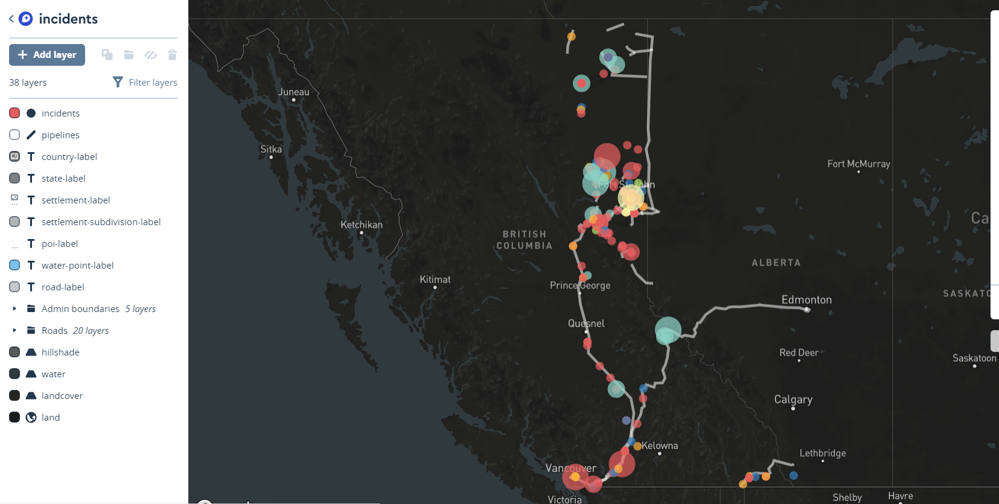
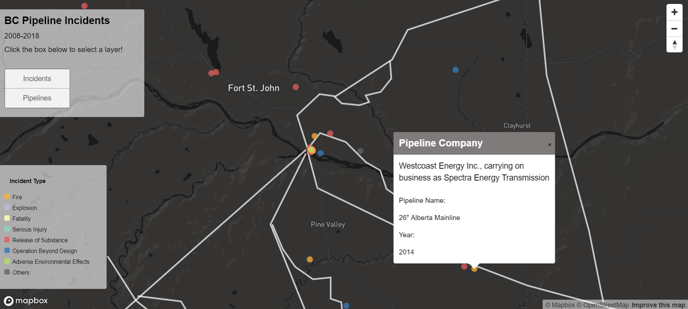
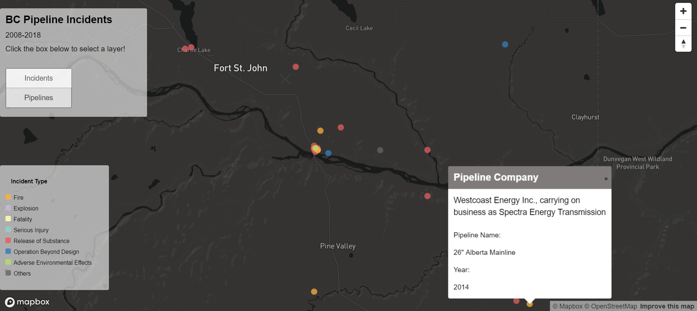

# Web Mapping
## **Reflective Analysis**

The map I created visualizes pipeline incidents data in British Columbia from 2008 to 2018. Oil and Gas transmission safety in BC is one of the biggest concerns for environmentalists and climate activists in BC like myself. However, many people have the misconception that as technology advances over time, pipelines have become safer and more secure; thus, continue to support pipeline development for lucrative short-term economic return. In the light of that, I created this map to show the frequency and distribution of pipeline incidences, with the goal to argue that pipeline safety does not necessarily enhance over time and dismantle this pro-pipeline reasoning. The map is designed for British Columbians who are concerned about pipeline safety and are familiar with the province. 

The two main layers of this map are incidents data in points and pipelines data in lines. Initially, I only mapped out incident points, but I found it to be out of context without complementing with the location of the associated pipelines. This prompted me to add a new layer for pipelines to the map. The organization of this map follows the visual hierarchy for Web maps.1  The stark colour contrast between title and legend text boxes, and the dark background draws users’ attention to the theme of the map immediately. This created the first level of the visual hierarchy. I created a legend to facilitate users' interaction with the map as the symbology I used may not be intuitive or explicitly suggest what they represent. Then, the two thematic symbols are highlighted as colourful circles pop out from the dark background due to the choice of bright and saturated colours. Circles were used to represent incident data for two reasons. First, circles are simple enough to be recognized at small sizes and offer good contrast against the background.2  Second, there is no universal icon that can adequately represent all the incidents. If a different icon is used for different incident types, the map will look messy given the density of the points. To solve this issue, I used colours to differentiate incident types. I adopted a colour palette from Colour Brewer to fill my point data. It is visually appealing and harmonious while providing a clear difference in hue for each qualitative point. I also set the opacity of both circles and lines to 0.75 such that overlapped features can be shown clearly as well. Circle sizes reflect the emergency level of the incident, which is an important indicator to pipeline safety. The second level of the visual hierarchy is the base map. It is minimalist and simplified in that not much street-level details were shown. This helps underscore the theme of this map, which is the overall distribution of incidents.3. The next level of the visual hierarchy is interactivity. Interactive popup windows are hidden, yet emphasized when triggered, as the white pop-up windows stand out from the dark base map due to colour contrast. 

My map focuses on the incidents occurred in BC, thus I set a panning restriction that stops users from zooming out of the province. This prevents data points from clustering when zoomed out to the world level. All incident points are shown at the max bound zoom level to showcase the density and distribution of incidents. When zoomed in, circles enlarge together with their surrounding features. I also added a zoom and rotation controls bar at the top right corner for easier navigation. Another interactive tool is a layer switcher which allows map users to hide or show a layer by clicking the corresponding buttons. This function was set up for users who wish to have a cleaner and less distracted view of the map when zoomed in (Figure 1). 

I recognized that there are several limitations and room for improvement for this project. First, the base map obtained from Mapbox Studio could be modified such that the colours of 'context' layers can match better with the main layers, and unnecessary 'context' layers, such as airport symbols, are removed.4 I made these amendments in the Mapbox studio interface as shown in figure 1, but unfortunately, they could not be exported to Mapbox GL JS. Thus, my changes in the base layer are not shown in my final map. Second, the size of the incident circles could be altered to reflect the level of emergency, an important indicator of pipeline safety.5 Figure 1 shows the variation of circle sizes based on this property I created in Mapbox Studio. I have tried multiple data-driven codes but none of them worked in Mapbox GL JS. 6 Third, data on pipelines is lacking. As a result, I had to draw the pipelines myself with reference to Google Maps, maps by the National Energy Board, and shapefiles created for the Trans Mountain pipeline. I recognized there is some degree of discrepancy in this layer which may slightly undermine the accuracy of the map at a close zoom level. Fourth, the year of incidents occurrence cannot be explicitly represented on the map. As one of my goals for this map is to show that safety had not been enhanced over the time, I would love to show the changes from 2008 to 2018 by displaying the data year by year using a time slider. However, I was not able to make that work after multiple attempts to follow online tutorials. 7 I resorted to adding time information inside the popup windows at the end.

Figure 1. Layer switcher to show and hide layers.

 
Figure 2. Exclusion of unnecessary ‘context’ layers, and changes in water and landcover colors done in MapBox Studio.

      
## **Link to Map**

https://emilyl3117.github.io/WebMapping/PipelineIncidents.html

## **Map Critique**
I engaged in map critique sessions with Nina, Louisa and Kiyomi, received generally positive feedbacks. In particular, they commented that the color contrast between data points and the background, as well as within the data points effectively create a clear visual hierarchy. Interactivity tools (layer switch, navigation toolbars, and the pop-up window) are helpful in enabling users to customize their map using experience and provide relevant information. Louisa pointed out that the layout of my original pop-up window was confusing, as the heading of it used to be ‘Pipeline Companies’ instead of ‘Incident Information’. I made changes to it for easier communication with map users.

#### Footnotes

1 Ian Muehlenhaus, Web cartography: Map design for interactive and mobile devices (Boca Raton, FL: CRC Press, 2013), 64. 

2 “The Guide to Map Design,” Mapbox, accessed January 30, 2019 https://www.mapbox.com/resources/guide-to-map-design-part-1a.pdf 

3 Muehlenhaus, 65.

4 Ibid, 65.

5 Ibid, 130.

6 I tried these codes: https://docs.mapbox.com/help/tutorials/gl-dds-map-tutorial/ 
https://blog.mapbox.com/introducing-data-driven-styling-in-mapbox-gl-js-f273121143c3 
https://blog.mapbox.com/announcing-expressions-in-gl-js-a72b55d0a6af https://github.com/mapbox/mapbox-gl-js/issues/2439 but unfortunately none of them worked for my tileset.

7 I tried this code https://docs.mapbox.com/mapbox-gl-js/example/timeline-animation/  and followed this tutorial https://docs.mapbox.com/help/tutorials/show-changes-over-time/ to try making the time slider. 

